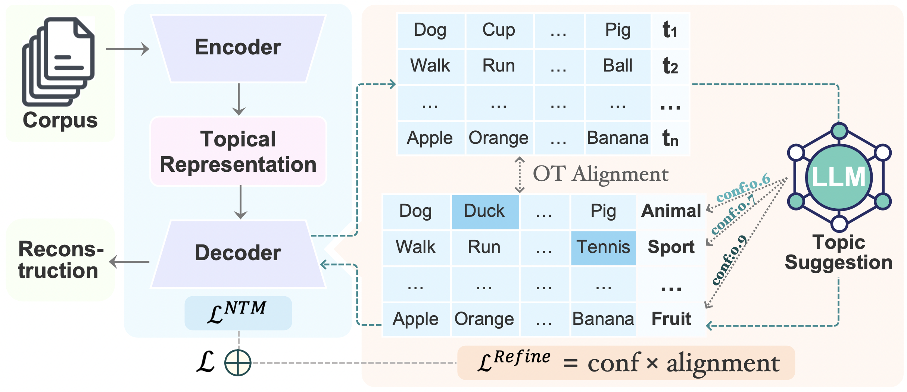

# 🧠 LLM-ITL: Neural Topic Modeling with Large Language Models in the Loop


This repository contains the official implementation of the paper:

> 📄 **Neural Topic Modeling with Large Language Models in the Loop**  
> 🏆 **Accepted to the Main Conference of [ACL 2025](https://2025.aclweb.org/)**  
> 🔗 [Read the paper](https://arxiv.org/abs/2411.08534) 

---

## 📂 Table of Contents

- [Overview](#-overview)
- [Features](#-features)
- [Installation](#-installation)
- [Usage](#-usage)
- [Examples](#-examples)
- [Citation](#-citation)
- [License](#-license)
---

## 📖 Overview
<p align="center">
  
</p>

<p align="center">
  <em>Overview of the LLM-ITL framework.</em>
</p>

**LLM-ITL** is a novel **LLM-in-the-loop framework** that creates a synergistic integration between Large Language Models (LLMs) and Neural Topic Models (NTMs), enhancing topic interpretability while preserving efficient topic and document representation learning.

In this framework:
- NTMs are used to learn global topics and document representations.
- An LLM refines the learned topics via an **Optimal Transport (OT)-based alignment objective**, dynamically adjusting based on the LLM's confidence in suggesting topical words.

LLM-ITL is modular and compatible with many existing NTMs. It significantly improves topic interpretability while maintaining the quality of document representations, as demonstrated through extensive experiments.

---

## ✨ Features

- 🔄 **Flexible integration**: Seamlessly combine a wide range of Large Language Models (LLMs) with various Neural Topic Models (NTMs) through a unified interface.
- ⚙️ **Modular design**: Swap LLMs, NTMs, datasets or evaluation metrics independently — ideal for research experiments and benchmarking.
- 🧠 **Supports various LLMs**: Easily integrates with LLMs such as [LLAMA3](https://huggingface.co/meta-llama/Meta-Llama-3-8B-Instruct), [Mistral](https://huggingface.co/mistralai/Mistral-7B-Instruct-v0.3), [Yi](https://huggingface.co/01-ai/Yi-1.5-9B-Chat), [Phi-3](https://huggingface.co/microsoft/Phi-3-mini-128k-instruct), [Qwen](https://huggingface.co/Qwen/Qwen1.5-32B-Chat), through a flexible, extensible design.
- 📊 **Supports various NTMs**: Easily integrates with NTMs such as [NVDM](https://arxiv.org/abs/1706.00359), [PLDA](https://arxiv.org/abs/1703.01488), [SCHOLAR](https://arxiv.org/abs/1705.09296), [ETM](https://arxiv.org/abs/1907.04907), [NSTM](https://arxiv.org/abs/2008.13537), [CLNTM](https://arxiv.org/abs/2110.12764), [WeTe](https://arxiv.org/abs/2203.01570), [ECRTM](https://arxiv.org/abs/2306.04217), through a flexible, extensible design.

- 📈 **Built-in evaluation metrics**: Includes support for evaluation of **topic coherence**, **topic alignment**, **topic diversity**, for comprehensive evaluation of topic models.

- 🗂️ **Dataset flexibility**: Compatible with widely used datasets such as **20News**, **AGNews**, **DBpedia**, **R8** — and easy to extend to custom datasets.


---

## 🛠 Installation

```bash
# Clone the repository
git clone https://github.com/Xiaohao-Yang/LLM-ITL.git
cd LLM-ITL

# Create a virtual environment
python3.9 -m venv venv
source venv/bin/activate  

# Install dependencies
pip install --upgrade pip
pip install -r requirements.txt
```

### 📁 External Files

Some required files are too large to be hosted. Please download them from the links below, place them in the specified directories, and **unzip them if needed**.

| File Name         | Description               | Path in Project         | Download Link |
|-------------------|:----------------------------:|--------------------------|:----------------:|
| `Wikipedia_bd.zip`       | Reference Corpus needed by evaluation   | `./`   | [🔗](https://hobbitdata.informatik.uni-leipzig.de/homes/mroeder/palmetto/Wikipedia_bd.zip) |
| `glove.6B.100d.txt`     | Word embeddings needed by WeTe       | `./topic_models/WeTe/`     | [🔗](https://drive.google.com/file/d/1pSThF2q2Cl99yaSos1k1Ba62oN7gqgCk/view?usp=sharing) |


## 🚀 Usage
### 🔹 Run a Topic Model
```bash
python main.py --dataset 20News --model nvdm --n_topic 50 --random_seed 1
```
### 🔹 Run a Topic Model with LLM-ITL
```bash
python main.py --dataset 20News --model nvdm --n_topic 50 --random_seed 1 --llm_itl
```
### 🔹 Run Evaluation
```bash
python eval.py --dataset 20News --model nvdm --n_topic 50 --eval_topics
```
### 📁 Output Files

🔸 Model checkpoints → ./save_models/

🔸 Topic files → ./save_topics/

🔸 Evaluation results → ./evaluation_output/


## 📌 Examples
<details>
<summary>🔍 Refine topics and get confidence ( <a href="refine_topics.ipynb">Jupyter Notebook</a> )</summary>
  
```python
# load functions
import torch
from transformers import AutoModelForCausalLM, AutoTokenizer
from generate import generate_one_pass, generate_two_step
```
We support the following LLMs. Please follow the links below to gain access (if necessary) to the corresponding models:

- Llama-3-8B-Instruct -- [model link](https://huggingface.co/meta-llama/Meta-Llama-3-8B-Instruct)
- Llama-3-70B-Instruct -- [model link](https://huggingface.co/meta-llama/Meta-Llama-3-70B-Instruct)
- Mistral-7B-Instruct-v0.3 -- [model link](https://huggingface.co/mistralai/Mistral-7B-Instruct-v0.3)
- Yi-1.5-9B-Chat -- [model link](https://huggingface.co/01-ai/Yi-1.5-9B-Chat)
- Phi-3-mini-128k-instruct -- [model link](https://huggingface.co/microsoft/Phi-3-mini-128k-instruct)
- Qwen1.5-32B-Chat -- [model link](https://huggingface.co/Qwen/Qwen1.5-32B-Chat)


We are not limited to these LLMs. Feel free to play with other models and modify the prompts in the ``create_messages_xx`` functions within ``generate.py``.


```python
# load the LLM

model_name = 'meta-llama/Meta-Llama-3-8B-Instruct'
# model_name = 'mistralai/Mistral-7B-Instruct-v0.3'
# model_name = '01-ai/Yi-1.5-9B-Chat'
# model_name = 'microsoft/Phi-3-mini-128k-instruct'

# Larger models:
# model_name = 'Qwen/Qwen1.5-32B-Chat'
# model_name = 'meta-llama/Meta-Llama-3-70B-Instruct'

# load model and tokenizer
model = AutoModelForCausalLM.from_pretrained(model_name,
                                             trust_remote_code=True,
                                             torch_dtype=torch.float16
                                             ).cuda()
tokenizer = AutoTokenizer.from_pretrained(model_name)
tokenizer.padding_side = "left"
tokenizer.pad_token = tokenizer.eos_token
```

```python
# example topics
topic1 = ['book', 'university', 'bank', 'science', 'vote', 'gordon', 'surrender', 'intellect', 'skepticism', 'shameful']
topic2 = ['game', 'team', 'hockey', 'player', 'season', 'year', 'league', 'nhl', 'playoff', 'fan']
topic3 = ['written', 'performance', 'creation', 'picture', 'chosen', 'clarify', 'second', 'appreciated', 'position', 'card']
topics = [topic1, topic2, topic3]
```


```python
# some configurations
voc = None                        # A list of words. 
                                  # The refined words will be filtered to retain only those that are present in the vocabulary.

inference_bs = 5                  # Batch size: the number of topics sent to the LLM for refinement at once.
                                  # Increase or reduce this number depending on your GPU memory.


instruction_type = 'refine_labelTokenProbs'    

# Different ways to get confidence socre, we support the following options:
# 'refine_labelTokenProbs'    -- Label token probaility
# 'refine_wordIntrusion'      -- Word intrusion confidence
# 'refine_askConf'            -- Ask for confidence
# 'refine_seqLike'            -- Length normalized sequence likelihood
# 'refine_twoStep_Score'      -- Self-reflective confidence score
# 'refine_twoStep_Boolean'    -- p(True)

# For more details about these confidence scores, please refer to our Paper.

```


```python
# generate topics
if instruction_type in ['refine_labelTokenProbs', 'refine_wordIntrusion', 'refine_askConf', 'refine_seqLike']:
    topic_probs, word_prob = generate_one_pass(model,
                                               tokenizer,
                                               topics,
                                               voc=voc,
                                               batch_size = inference_bs,
                                               instruction_type=instruction_type)

elif instruction_type in ['refine_twoStep_Score', 'refine_twoStep_Boolean']:
    topic_probs, word_prob = generate_two_step(model,
                                                   tokenizer,
                                                   topics,
                                                   voc=voc,
                                                   batch_size=inference_bs,
                                                   instruction_type=instruction_type)
```

  
```python
print('Topic label and confidence:')
for i in range(len(topic_probs)):
    print('Topic %s: ' % i, topic_probs[i])

print()
print('Topic words and probabilities:')
for i in range(len(word_prob)):
    print('Topic %s: ' % i, word_prob[i])
```

    Topic label and confidence:
    Topic 0:  {'Higher Learning': 0.17292044166298481}
    Topic 1:  {'Ice Sport': 0.39517293597115355}
    Topic 2:  {'Artistic Expression': 0.056777404880380314}
    
    Topic words and probabilities:
    Topic 0:  {'university': 0.1, 'degrees': 0.1, 'curriculum': 0.1, 'book': 0.1, 'research': 0.1, 'skepticism': 0.1, 'education': 0.1, 'intellect': 0.1, 'knowledge': 0.1, 'science': 0.1}
    Topic 1:  {'nhl': 0.1, 'league': 0.1, 'season': 0.1, 'hockey': 0.1, 'match': 0.1, 'player': 0.1, 'rival': 0.1, 'playoff': 0.1, 'game': 0.1, 'team': 0.1}
    Topic 2:  {'creative': 0.1, 'written': 0.1, 'picture': 0.1, 'appreciated': 0.1, 'artist': 0.1, 'imagination': 0.1, 'clarify': 0.1, 'creation': 0.1, 'chosen': 0.1, 'performance': 0.1}


</details>

## 🧾 Citation

```bibtex
@article{yang2024neural,
  title={Neural Topic Modeling with Large Language Models in the Loop},
  author={Yang, Xiaohao and Zhao, He and Xu, Weijie and Qi, Yuanyuan and Lu, Jueqing and Phung, Dinh and Du, Lan},
  journal={arXiv preprint arXiv:2411.08534},
  year={2024}
}
```

## 📄 License

This work is licensed under the [Creative Commons Attribution 4.0 International License](https://creativecommons.org/licenses/by/4.0/).


